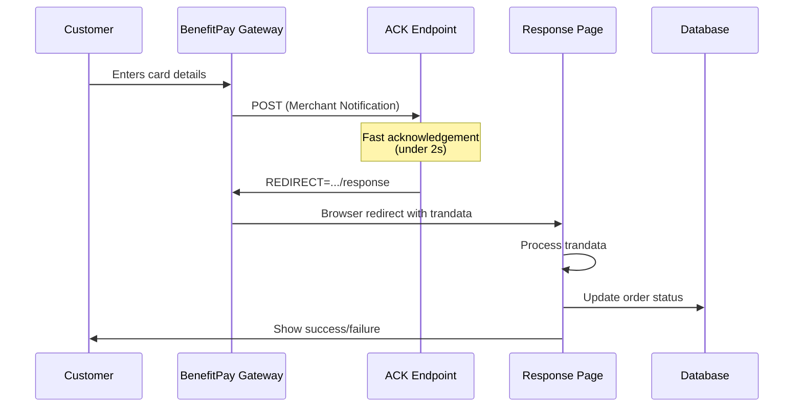

# BenefitPay Integration - Implementation Summary

## Changes Implemented

This implementation fixes the **IPAY0400001 "Problem occurred while getting merchant acknowledgement"** error and HTTP 405 issues by properly separating the acknowledgement (ACK) flow from payment processing.

## Architecture Changes

### Before (Incorrect)
```
BenefitPay → /api/payments/benefit/callback (processes payment + returns REDIRECT)
          → Browser redirected with very long trandata URL
          → HTTP 405 error
```

### After (Correct)
```
BenefitPay → /api/payments/benefit/ack (fast ACK only, returns REDIRECT)
          → Browser redirected to /pay/benefit/response?orderId=...
          → Response page processes trandata from URL
          → Payment completed
```

## Files Created

1. **`client/src/app/api/payments/benefit/ack/route.ts`** (NEW)
   - Fast acknowledgement endpoint (under 2 seconds)
   - Returns `REDIRECT=...` with HTTP 200, text/plain
   - NO authentication (called by BenefitPay servers)
   - NO payment processing (just acknowledges)

2. **`ADD_BENEFIT_TRACK_ID.sql`** (NEW)
   - Database migration to add `benefit_track_id` column
   - Stores numeric trackId for BenefitPay compliance

3. **`BENEFIT_ENV_VARIABLES.md`** (NEW)
   - Environment variables configuration guide
   - Critical instructions for CLIENT_URL setup

4. **`BENEFIT_IMPLEMENTATION_SUMMARY.md`** (NEW, this file)
   - Complete implementation summary

## Files Modified

1. **`client/src/app/api/payments/benefit/init/route.ts`**
   - Changed `responseURL` to point to ACK endpoint
   - Changed `errorURL` to point to error page
   - Always uses production URL (never localhost)
   - Generates numeric `trackId` instead of UUID
   - Stores trackId mapping in database

2. **`client/src/app/pay/benefit/response/page.tsx`**
   - Simplified to process trandata from URL
   - Removed complex retry logic
   - Cleaner error handling
   - Better user experience

## Files Deleted

1. **`client/src/app/api/payments/benefit/callback/route.ts`** (DELETED)
   - Replaced by ACK endpoint
   - Old approach was doing too much in one place

## Key Technical Changes

### 1. ACK Endpoint Requirements
- **Speed**: Must respond in under 2 seconds
- **Format**: Plain text `REDIRECT=...` (not JSON)
- **Status**: HTTP 200 (not 303 or other redirects)
- **Headers**: `Content-Type: text/plain`
- **Authentication**: NONE (BenefitPay servers call this)

### 2. URL Changes
- **responseURL**: `https://helloonebahrain.com/api/payments/benefit/ack?orderId=...`
- **errorURL**: `https://helloonebahrain.com/pay/benefit/error?orderId=...`
- **Never use localhost**: BenefitPay servers cannot reach it

### 3. TrackId Format
- **Before**: UUID (e.g., `03245513-c468-4bf8-9403-2f5b59ccced8`)
- **After**: Numeric timestamp (e.g., `1704412800000`)
- **Why**: BenefitPay recommends numeric IDs

### 4. Payment Processing Flow


## Database Changes

Run this SQL migration in Supabase:

```sql
-- Add benefit_track_id column
ALTER TABLE orders ADD COLUMN IF NOT EXISTS benefit_track_id VARCHAR(50);
CREATE INDEX IF NOT EXISTS idx_orders_benefit_track_id ON orders(benefit_track_id);
```

Or use the provided file: `ADD_BENEFIT_TRACK_ID.sql`

## Environment Variables

### Required Variables

Set these in both `client/.env.local` and Vercel:

```bash
CLIENT_URL=https://helloonebahrain.com
BENEFIT_TRANPORTAL_ID=your_id
BENEFIT_TRANPORTAL_PASSWORD=your_password
BENEFIT_RESOURCE_KEY=your_key
BENEFIT_ENDPOINT=https://test.benefit-gateway.bh/payment/API/hosted.htm
```

### Critical: CLIENT_URL

- **MUST** be production URL (never `localhost:3000`)
- BenefitPay servers need to reach your ACK endpoint
- If using localhost, you'll get IPAY0400001 error

See `BENEFIT_ENV_VARIABLES.md` for detailed instructions.

## Deployment Steps

### 1. Run Database Migration

In Supabase SQL Editor:
```sql
-- Copy and run ADD_BENEFIT_TRACK_ID.sql
```

### 2. Update Environment Variables

In Vercel Dashboard:
1. Go to Settings → Environment Variables
2. Update `CLIENT_URL` to `https://helloonebahrain.com`
3. Verify all BenefitPay credentials are set
4. Apply to Production, Preview, and Development

### 3. Deploy to Vercel

```bash
git add .
git commit -m "Fix BenefitPay ACK flow - separate acknowledgement from processing"
git push origin master:main
```

### 4. Verify Deployment

Check that ACK endpoint is publicly accessible:
```bash
curl https://helloonebahrain.com/api/payments/benefit/ack?orderId=test
```

Expected response:
```
REDIRECT=https://helloonebahrain.com/pay/benefit/response?orderId=test
```

### 5. Test Payment Flow

1. Create a test order
2. Select BenefitPay payment method
3. Complete payment on BenefitPay gateway
4. Verify redirect to response page
5. Check order status in database

## Troubleshooting

### Issue: Still getting IPAY0400001

**Possible causes:**
- CLIENT_URL still set to localhost
- ACK endpoint not publicly accessible
- ACK endpoint taking too long (over 2 seconds)
- Wrong responseURL in init endpoint

**Solution:**
- Verify CLIENT_URL in Vercel environment variables
- Test ACK endpoint with curl
- Check Vercel function logs for errors

### Issue: HTTP 405 on response page

**Possible causes:**
- Very long trandata in URL (should be fixed now)
- Route not properly deployed

**Solution:**
- Redeploy application
- Check Vercel build logs
- Verify response page exists in deployment

### Issue: Payment not updating in database

**Possible causes:**
- process-response endpoint has errors
- Database connection issues
- Authentication issues

**Solution:**
- Check Vercel function logs
- Verify Supabase credentials
- Test process-response endpoint manually

## Testing Checklist

After deployment:

- [ ] ACK endpoint returns `REDIRECT=...` (curl test)
- [ ] ACK endpoint is publicly accessible
- [ ] Response page loads without errors
- [ ] Can create test order
- [ ] Can initiate BenefitPay payment
- [ ] Payment redirects to response page
- [ ] Order status updates correctly
- [ ] Success page displays transaction details
- [ ] Error scenarios handled gracefully

## Next Steps

1. **Deploy**: Push changes to git and deploy to Vercel
2. **Migrate DB**: Run the SQL migration in Supabase
3. **Configure**: Set environment variables in Vercel
4. **Test**: Complete end-to-end payment test
5. **Monitor**: Check Vercel logs for any issues

## Support

If issues persist:
1. Check Vercel function logs
2. Check Supabase logs
3. Verify all environment variables
4. Test ACK endpoint accessibility
5. Review BenefitPay portal settings (Merchant Notification)

## Summary

This implementation properly separates the BenefitPay Merchant Notification acknowledgement from payment processing, fixing the IPAY0400001 error and HTTP 405 issues. The key changes are:

1. ✅ Fast ACK endpoint (under 2 seconds)
2. ✅ Proper REDIRECT response format
3. ✅ Production URLs (no localhost)
4. ✅ Numeric trackId
5. ✅ Simplified payment processing flow

The integration now follows BenefitPay's requirements exactly.


